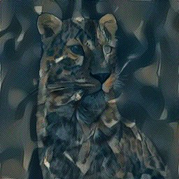

ПРОЕКТ ПЕРЕНОСА СТИЛЯ НА ФОТО

Данный проект позволяет создать телеграмм-бот для переноса стиля с одной картинки на другую.

Используемые инструменты (библиотеки Python), указаны в файле requirements.txt.

Для работы также потребуется загрузка модели VGG19, т.к. на её основе сделан процесс обучения и переноса стиля.

Для корректной работы программы необходимо создать файл ".env" на основе файла ".env_example", где указать токен создаваемого бота.

Данный телеграмм-бот будет реагировать на 3 апдейта (команды /transfer_style, /help, и загрузку фото)

Для получения результата необходимо последовательно загрузить два фото, первое с изображением, второе со стилем, результат выдается картинкой с разрешением 256х256.

Скорость выдачи картинки зависит от производительности центрального процессора и в среднем составляет 1-2 минуты.

 

